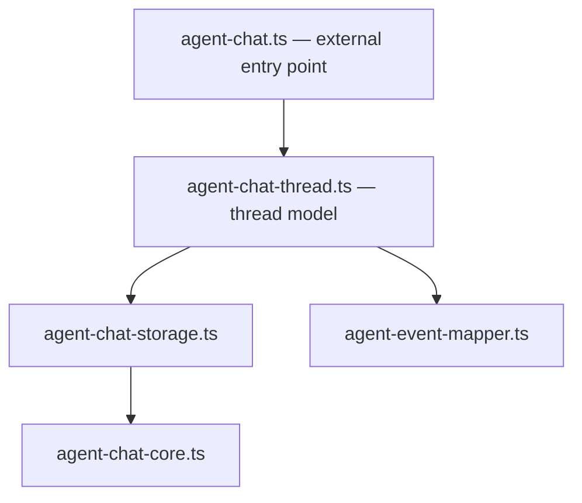

**Chat module**

This defines the Chat / Thread model.

## Topology

```mermaid
flowchart TB
  entry["agent-chat.ts — external entry point"]
  thread["agent-chat-thread.ts — thread model"]
  storage["agent-chat-storage.ts"]
  mapper["agent-event-mapper.ts"]
  paths["agent-chat-core.ts"]

  entry --> thread
  thread --> storage
  thread --> mapper
  storage --> paths
```
